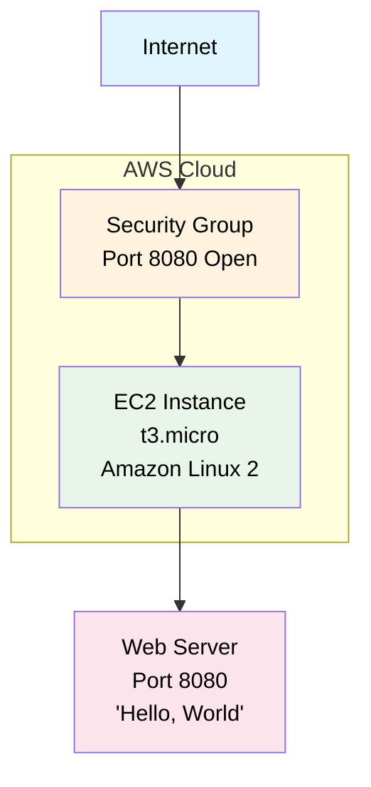

```mermaid
graph TB
    A[Internet] --> B[Security Group<br/>Port 8080 Open]
    B --> C[EC2 Instance<br/>t3.micro<br/>Amazon Linux 2]
    C --> D[Web Server<br/>Port 8080<br/>'Hello, World']

    subgraph "AWS Cloud"
        B
        C
    end

    style A fill:#e1f5fe,color:black
    style B fill:#fff3e0,color:black
    style C fill:#e8f5e8,color:black
    style D fill:#fce4ec,color:black
```