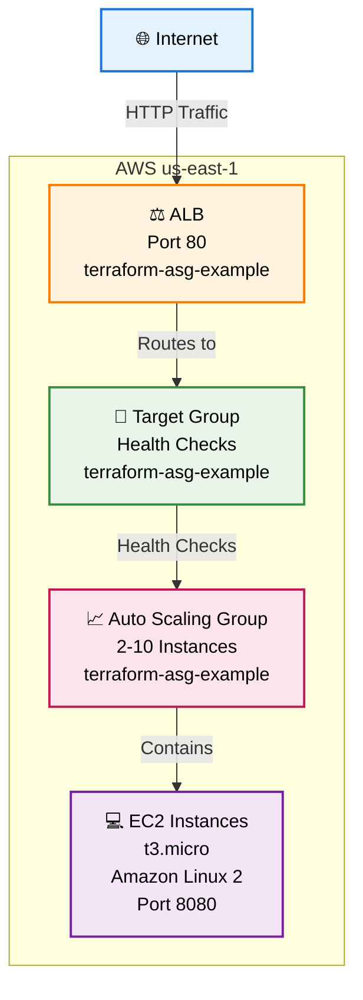

# Architecture Diagram - Day 4: Auto Scaling and Load Balancing

## Mermaid Diagram



## Alternative: ASCII Art Diagram

```
┌─────────────┐     ┌─────────────────┐     ┌─────────────────┐     ┌─────────────────┐     ┌─────────────┐
│   🌐        │     │   ⚖️            │     │   🎯            │     │   📈            │     │   💻        │
│  Internet   │────▶│ ALB (Port 80)  │────▶│ Target Group    │────▶│ Auto Scaling   │────▶│ EC2         │
│             │     │ Load Balancer  │     │ Health Checks   │     │ Group (2-10)   │     │ Instances   │
│             │     │                 │     │                 │     │                 │     │ Port 8080   │
└─────────────┘     └─────────────────┘     └─────────────────┘     └─────────────────┘     └─────────────┘
```

## Terraform Graph Output

```
digraph G {
  rankdir = "RL";
  node [shape = rect, fontname = "sans-serif"];
  "aws_launch_template.myLT";
  "aws_autoscaling_group.myASG";
  "aws_lb.myALB";
  "aws_lb_target_group.asg";
  "aws_lb_listener.http";
  "aws_security_group.alb";
  "data.aws_vpc.default";
  "data.aws_subnets.default";
  // Dependencies between resources
}
```

## Resources Used

- **Launch Configuration**: Template for EC2 instances in ASG
- **Auto Scaling Group**: Scales between 2-10 t3.micro instances
- **Application Load Balancer**: Distributes traffic on port 80
- **Target Group**: HTTP health checks every 15 seconds
- **Security Group**: Allows inbound traffic on port 8080
- **Data Sources**: Default VPC and subnets
- **Region**: us-east-1